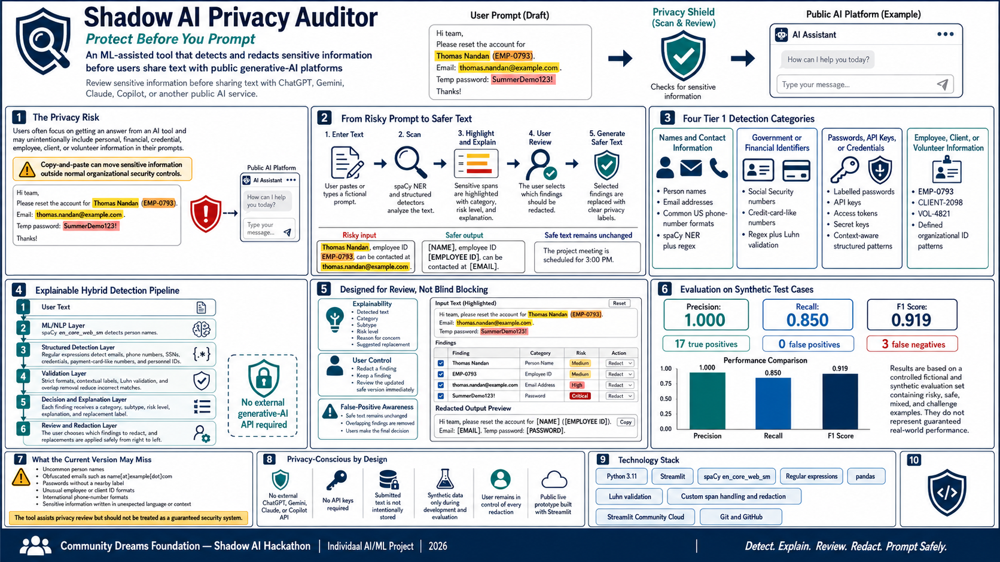

# Shadow AI Privacy Auditor

[](https://www.python.org/)
[](https://streamlit.io/)
[](https://spacy.io/)
[](https://shadow-ai-privacy-auditor-tarachd.streamlit.app/)

**An ML-assisted privacy review tool that detects sensitive information before text is shared with public generative-AI platforms.**

🔗 **Live Application:**  
https://shadow-ai-privacy-auditor-tarachd.streamlit.app/

🎥 **Video Walkthrough:**  
https://youtu.be/WqobcFGLfpg

---

## Project Overview

Generative-AI tools such as ChatGPT, Gemini, Claude, and Copilot are increasingly used for everyday work. However, users may unintentionally paste personally identifiable information, credentials, financial identifiers, or internal organizational information into these systems.

**Shadow AI Privacy Auditor** provides a privacy review step before text is shared with a public AI platform.

The application scans user-provided text, identifies potentially sensitive information, explains why each finding may create a privacy risk, and allows the user to decide which findings should be redacted.

The system combines **machine-learning-based named entity recognition with structured pattern detection and validation rules**.

---

## Demo



Try the deployed application:

**https://shadow-ai-privacy-auditor-tarachd.streamlit.app/**

A complete demonstration is also available here:

**https://youtu.be/WqobcFGLfpg**

---

## Key Features

- Detects multiple categories of potentially sensitive information
- Uses **spaCy Named Entity Recognition (NER)** for person-name detection
- Uses structured regex detectors for predictable sensitive-data formats
- Validates credit-card-like numbers using the **Luhn algorithm**
- Assigns understandable risk levels to detected information
- Highlights sensitive spans directly in the original text
- Explains why each finding may represent a privacy concern
- Allows users to individually select or deselect findings for redaction
- Generates a reviewed version of the text with selected information removed
- Does not require an external generative-AI API
- Includes a reproducible synthetic evaluation pipeline

---

## Sensitive Information Detected

The current version focuses on four major categories.

| Category | Examples | Detection Method |
|---|---|---|
| Names & Contact Information | Person names, email addresses, phone numbers | spaCy NER + regex |
| Government & Financial Identifiers | SSNs, credit-card-like numbers | Regex + Luhn validation |
| Credentials | Passwords, API keys, access tokens, secret keys | Context-aware regex |
| Organizational IDs | Employee, client, volunteer IDs | Structured regex |

Examples of organizational identifiers supported by the current implementation include:

```text
EMP-0793
CLIENT-2098
VOL-4821
```

---

## How It Works

```text
                    User Input
                        │
                        ▼
               ┌─────────────────┐
               │  Privacy Scan   │
               └────────┬────────┘
                        │
           ┌────────────┴────────────┐
           ▼                         ▼
    spaCy NER Model          Structured Detectors
    Person Detection          Regex + Validation
           │                         │
           └────────────┬────────────┘
                        ▼
                Combine Findings
                        │
                        ▼
               Remove Overlaps
                        │
                        ▼
          Highlight + Explain Risks
                        │
                        ▼
                 User Review
                        │
                        ▼
              Selective Redaction
                        │
                        ▼
              Safer Reviewed Text
```

The architecture deliberately uses different techniques depending on the type of information being detected.

**Machine learning** is useful for information such as person names, where the meaning depends on language and context.

**Pattern-based detection** is more appropriate for structured information such as SSNs, email addresses, credentials, and organizational IDs.

---

## ML / NLP Component

The machine-learning component uses the pretrained:

```text
spaCy en_core_web_sm
```

named-entity recognition model.

The complete input text is processed by spaCy, but only entities labelled `PERSON` are retained for person-name privacy review.

This allows the project to incorporate NLP-based semantic detection without sending the submitted text to an external large language model.

For additional information, see the [Model Card](docs/model_card.md).

---

## Evaluation

The complete hybrid detection pipeline was evaluated using labelled **fictional and synthetic** examples.

The evaluation includes:

- risky examples
- safe examples
- mixed-category examples
- challenge cases designed to expose weaknesses in the detectors

### Results

| Metric | Result |
|---|---:|
| **Precision** | **1.000** |
| **Recall** | **0.850** |
| **F1 Score** | **0.919** |
| True Positives | 17 |
| False Positives | 0 |
| False Negatives | 3 |

The strong precision indicates that the current test set produced few unnecessary privacy warnings, while the lower recall exposed several useful failure cases.

The missed challenge cases included examples involving:

- an uncommon person name
- an obfuscated email format
- a password without an explicit credential label

These results apply only to the current synthetic evaluation set and should **not** be interpreted as guaranteed real-world performance.

The evaluation can be reproduced using:

```bash
python src/evaluate.py
```

The labelled cases and detailed results are available in:

```text
tests/test_cases.csv
tests/evaluation_results.csv
```

---

## User-Controlled Redaction

The application intentionally does not automatically remove every detected item.

For each finding, the interface provides:

- detected text
- sensitive-data category
- subtype
- risk level
- explanation
- proposed replacement
- user-controlled redaction checkbox

This design keeps the user involved in the privacy decision.

For example, a person's name may be sensitive in one context but public and harmless in another. The system therefore provides **decision support rather than making an irreversible privacy decision automatically**.

---

## Privacy-Aware Design

A privacy tool should avoid creating an additional privacy problem.

For that reason, the application does **not require an external generative-AI API** for detection.

Submitted text is processed by the deployed Python application and is not intentionally forwarded to ChatGPT, Gemini, Claude, Copilot, or another public generative-AI platform as part of the detection pipeline.

The application is also designed not to intentionally store submitted text.

Only fictional and synthetic data was used for development and evaluation.

---

## Technology Stack

| Component | Technology |
|---|---|
| Programming Language | Python 3.11 |
| Web Application | Streamlit |
| NLP / Machine Learning | spaCy |
| Structured Detection | Python regular expressions |
| Validation | Luhn algorithm |
| Data Processing | pandas |
| Evaluation | Precision, Recall, F1 |
| Deployment | Streamlit Community Cloud |
| Version Control | Git / GitHub |

---

## Repository Structure

```text
shadow-ai-privacy-auditor/
│
├── README.md
├── requirements.txt
├── environment-local.yml
├── .gitignore
│
├── src/
│   ├── app.py
│   ├── detectors.py
│   └── evaluate.py
│
├── tests/
│   ├── test_cases.csv
│   └── evaluation_results.csv
│
├── docs/
│   ├── architecture.md
│   └── model_card.md
│
└── assets/
    └── Shadow_AI_Privacy_Auditor.png
```

### Main Components

- **`src/app.py`** — Streamlit interface and interactive review workflow
- **`src/detectors.py`** — NLP, regex, validation, overlap handling, and redaction logic
- **`src/evaluate.py`** — evaluation pipeline
- **`tests/test_cases.csv`** — labelled synthetic evaluation cases
- **`tests/evaluation_results.csv`** — case-level evaluation output
- **`docs/architecture.md`** — technical architecture and design decisions
- **`docs/model_card.md`** — NLP model documentation and limitations

---

## Run Locally

### Option 1 — Conda

Clone the repository:

```bash
git clone https://github.com/tarachd/shadow-ai-privacy-auditor.git
cd shadow-ai-privacy-auditor
```

Create the environment:

```bash
conda env create -f environment-local.yml
```

Activate it:

```bash
conda activate shadow-ai-auditor
```

Run the application:

```bash
streamlit run src/app.py
```

---

### Option 2 — pip

Clone the repository:

```bash
git clone https://github.com/tarachd/shadow-ai-privacy-auditor.git
cd shadow-ai-privacy-auditor
```

Create and activate a Python virtual environment, then install the dependencies:

```bash
python -m pip install -r requirements.txt
```

Run:

```bash
streamlit run src/app.py
```

---

## Known Limitations

The current prototype may miss:

- uncommon person names
- obfuscated emails such as `name[at]example[dot]com`
- credentials without recognizable labels
- unusual employee or client identifier formats
- international phone-number formats
- sensitive information expressed in unexpected language or context

The general-purpose NER model may also identify a person name even when that name is public or does not represent a meaningful privacy risk.

These limitations are one reason the application keeps the user in the review loop.

---

## Future Improvements

Possible extensions include:

- larger or domain-specific NER models
- physical-address detection
- medical and health-information detection
- confidential organizational-information detection
- multilingual privacy detection
- configurable organization-specific privacy rules
- expanded credential detection
- browser-extension integration
- larger and more diverse evaluation datasets
- model comparison and error-analysis dashboards

---

## Project Background

This project was developed as an individual project for the **Community Dreams Foundation (CDF) Shadow AI Hackathon**.

The project focused on building an ML-assisted privacy safeguard for users who may unintentionally expose sensitive information while using public generative-AI tools.

The public repository contains the implementation, reproducible evaluation, technical documentation, model card, and deployment resources.

---

## Responsible Use

Shadow AI Privacy Auditor is a prototype and educational project.

It should be treated as an **assistive privacy-review tool**, not as a replacement for enterprise Data Loss Prevention (DLP) systems, cybersecurity controls, organizational privacy policies, or professional security review.

---

## Author

**Tarasankar Das**

Data Science | Machine Learning | Biomedical & Healthcare Analytics

GitHub: [tarachd](https://github.com/tarachd)

.
